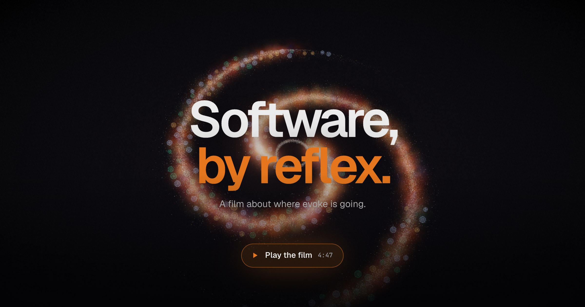

<p align="center"></p>

# evoke

**Software, by reflex.** Natural-language commands for small programs you install. A reflex is a small program
you install and ask for in your words. Type one sentence, and `evoke` reads it against every reflex you installed.
It picks the ones the sentence asks for and fills their inputs from your words or your own lists. It shows the
plan before anything runs. It runs when it is sure enough for what the program changes, asks when something is
missing or unclear, and always asks before anything that cannot be undone.

<p align="center"><a href="https://evoke.build/film.html"></a></p>

## Where evoke is going

Take back control. Keep the intelligence. Every system people act through ships reflexes: small programs with a
manifest anyone can read. You state a goal in one sentence, and `evoke` turns it into a plan across those
reflexes, one you can read before anything runs. Lookups fire together. Changes wait their turn. Every value comes
from a closed source, every step carries its probability, and each step that cannot be undone waits for the
person it belongs to.

Then the plan crosses machines. Each step runs where its program, its keys and its approver live. Every call is
signed, every machine checks it against its own rules, and every machine keeps its own gate. Nothing sits in the
middle to route, store or approve. Not even us.

Work that today is clicks across ten tools becomes a network of small programs. It fires the way a trained
reflex does: at once where it is sure, and stopping where it must.

**People write the programs. A sentence picks the plan. A person signs what cannot be undone.**

Take an outage. "checkout is failing in eu-west" lights seven reflexes as one plan:

- **Three lookups fire together.** `errors`, `deploys` and `logs`, each on the machine that holds them.
- **One step takes all three.** `suspect` reads the three results and names the release.
- **The rollback stops and asks.** It cannot be undone, so the machine that runs it asks its own on-call,
  however sure the plan was.
- **Two changes in turn.** `post` tells the channel, then `status` updates the page.
- **Every machine answers with a signed receipt.** What ran, on which version, who approved it, and when.

A stolen laptop, a late shipment, closing the month, a cancelled flight and a new colleague have the same shape.
The home page, [evoke.build](https://evoke.build), draws the whole picture with the parts that run today marked,
and the [film](https://evoke.build/film.html) plays it in five minutes. Everything in it is an illustration: its
reflexes, machines, people and companies are made up.

## It runs today

One sentence, a few reflexes, on your machine. Here is what `evoke` printed in its tests:

```text
$ evoke "look up dana's address and email them"
  1  contact name="dana"  0.90
  2  mail · takes email from 1
dana <dana@example.com>
  2  mail to="dana@example.com"  0.88
drafted to dana@example.com
```

One sentence asked for two reflexes, and the plan showed before anything ran. Step 2 takes the email step 1
finds, because `contact` says its result holds an email and `mail`'s `to` takes one. The lookup ran, the draft was
addressed, and nothing was sent. `contact` and `mail` are illustrations from the tests. The reflexes you can
install are in [the collection](https://evoke.build/manual/collection.html): thirteen, for a Mac.

```bash
curl -fsSL https://evoke.build/install.sh | sh    # the CLI, on macOS and Linux
npm install @evoke-build/evoke                    # the SDK, for Node 24.5 or newer
```

One core, three ways in: a CLI where you type what you want, a package manager that installs reflexes from git,
and a TypeScript SDK that puts the same decisions inside your app.

A classifier reads the sentence: [Jev](https://typesafe.ai), TypeSafe AI's model. It answers closed questions,
which reflex or none and which value for each input, and gives each answer a probability. The questions, and the
gate that decides whether a call runs, confirms or asks, are `evoke`'s. The core names no engine.

A reflex is a recipe: written once, shared through git, improved by everyone. A fetched reflex runs as you, held
by the kernel to what its manifest declares: the paths it reads and writes, the hosts it reaches, the programs it
runs. A reach past the declaration ends the run: [Security](https://evoke.build/manual/security.html).

## It stops

The value of all this is what it refuses to do. Three sessions from the tests. Nothing ran under its bar, and
nothing that cannot be undone ran without a yes:

```text
$ evoke "restart the computer"
  power action="restart" · destructive · weakest: route 0.97
  Really restart now?  [y]es [n]o [t]each > n
[2]
$ evoke "set the volume to 150 percent"
  How loud, in percent?  150 percent is outside 0–100  > 40
  volume level="40"  0.93
volume set to 40%
$ evoke "kill the lights in the den and feed the cat"
  1  lights room="den" state="off"  0.85
  2  "feed the cat" · no reflex
[2]
```

At 0.97 it was sure, and it still asked, because a reflex that cannot be undone always asks. There is no flag
that skips it. A volume of 150 percent never reached a program: `evoke` named the allowed range, 0 to 100, and
asked for a value inside it. A sentence whose second part fits nothing ran nothing, not even the lights, rather
than do half of it. `evoke try` shows every judgment, `evoke calibrate` reports what the numbers meant on your own
records, and one line in a file you own moves a bar.

## What holds at every size

The same rules for one reflex on a laptop and a thousand across companies. The first five hold today, pinned by
transcripts the tests replay offline.

1. **Nothing is made up.** Every value is an option the author listed, a word you taught it, or a piece of what
   you typed, checked against its range.
2. **The plan comes first.** You see every step before any of them runs. A part that fits nothing refuses the
   whole sentence.
3. **A number on every step.** Each decision says how sure `evoke` is: the weakest of its judgments. The bar
   rises with what the step would change, 0.6 to look something up and 0.8 to change something. The classifier's
   provider trains those probabilities to be calibrated: across many answers, those given 0.85 should be right
   about 85 times in 100.
4. **A person before the irreversible.** Anything that cannot be undone asks a person, however sure `evoke` is.
   No flag, file or agent skips it.
5. **Lookups together, changes in turn.** What only reads runs side by side. What changes waits its turn. A
   result fills a later step, by its kind.

The road adds three:

6. **Results fill, never steer.** A result can pick the next step only from a list its author wrote, printed
   with the plan.
7. **Every machine keeps its gate.** Each machine checks every call against its own rules and asks its own
   person, even after you said yes.
8. **No center.** Machines find each other through public addresses. Nobody sits in the middle to route, store
   or approve. Not even us.

What is new is the plan: not the app, not the flow, not the prompt.

## A reflex is a neuron

The picture is exact enough to design by. A reflex is a neuron: one program, one manifest. The sentence is the
stimulus. The confidence is the activation, and the bar set by the effect is the threshold. A result carried into
a later step is a synapse. Lookups that depend on nothing are parallel pathways. A question, a confirm or a
refusal is inhibition. Teaching it a word in one line is plasticity, with nothing retrained. Everything installed
is the connectome: about a hundred reflexes per request today. Each row of
[the map](https://evoke.build/#picture) says whether it runs today.

## The road

In order, each stop measured before the next one is promised. The first runs today.

- **Today.** One sentence, a few reflexes. The plan first, lookups together, a person before what cannot be
  undone.
- **Trust at today's size.** A sandbox around every reflex. The confidence numbers measured. Six real problems
  pinned as tests.
- **Plans people can hold.** Plans saved, reviewed and run later by someone else. A short sentence for a long
  reviewed plan. Plans that wait overnight for a yes.
- **Many reflexes, many authors.** Hundreds installed at once. A second engine that runs on your machine.
  Reflexes from people you have never met.
- **Everywhere people act.** Apps that ship their reflexes. Chat and other places to ask. Agents that propose
  while `evoke` decides.
- **Across machines.** Plans that cross machines and companies, every step signed and every gate kept.

`evoke` sends nothing home, so every measure is one the tests take or a person reports:

- The six problems green over real systems, for a team that is not us.
- Wrong runs at or over the bar to change something, counted per thousand.
- The plan chosen right at twenty, fifty, a hundred, three hundred and a thousand reflexes installed.
- Plans written by one person and run by another. Reflexes shipped by people we have never met.

## Start

[Install](https://evoke.build/manual/start/install.html), then
[the first ten minutes](https://evoke.build/manual/start/first-run.html). Then
[write a reflex](https://evoke.build/manual/author/first-reflex.html), or
[put decisions in your app](https://evoke.build/manual/sdk/getting-started.html). The whole
[manual](https://evoke.build/manual/) is at [evoke.build](https://evoke.build).

## Repository

| Directory                             | Holds                                                                                              |
| :------------------------------------ | :------------------------------------------------------------------------------------------------- |
| [crates/](Cargo.toml)                 | The Rust workspace: `evoke-core`, the rules with no engine and no I/O; `evoke-adapters`; `evoke-wasm`, the SDK's boundary; `evoke`, the CLI |
| [sdk/](sdk/README.md)                 | `@evoke-build/evoke`: TypeScript over the same core, compiled to WebAssembly                        |
| [spec/](spec/README.md)               | The executable spec: schemas, golden vectors and transcripts, with the tests of both hosts          |
| [reflexes/](reflexes/README.md)       | The first-party collection, published as `evoke-build/reflexes`                                     |
| [docs/manual/](https://evoke.build/manual/) | The manual, as published at evoke.build                                                       |
| [site/](https://evoke.build)          | evoke.build: the home page, the film, the install script, and the manual rendered by mdBook         |

## Developing

Tools and tasks are pinned by [mise](https://mise.jdx.dev). With git and a C compiler on the machine, run
`mise install`, then `mise run lint` and `mise run test`. Those two are what CI runs; `mise tasks` lists the rest.
Packaging a Linux release needs `musl-tools` as well. `bin/dx <command>` runs a command with the same toolchain
inside an OrbStack machine named `devbox`, for those who develop in one. The tests need no key.
To decide against Jev, export `TYPESAFE_API_KEY` for the `jev` adapter, or `OPENJEV_API_KEY` for `openjev`. To
decide without one, the `replay` adapter answers from a file you write: [Testing](https://evoke.build/manual/sdk/testing.html#the-cli-on-a-recording).

## Licence

[Apache-2.0](LICENSE). The collection under [reflexes/](reflexes/README.md) is [MIT](reflexes/LICENSE).

**Trademarks.** Except for displaying the licence details and identifying us as the origin of the software, you have
no right under the licence to use our trademarks, trade names, service marks or product names: the name `evoke`, the
name evoke.build and the logo. A fork takes its own name and logo. [TRADEMARK.md](TRADEMARK.md).
